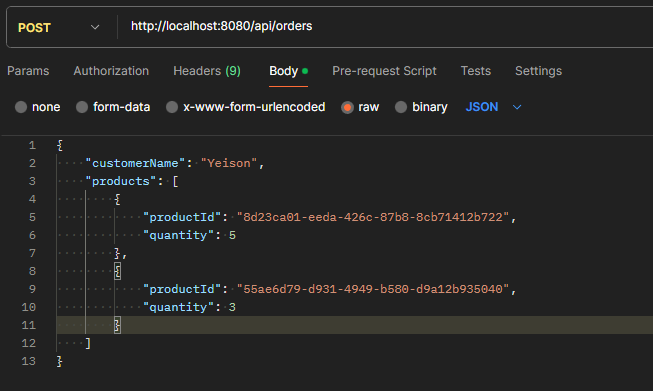
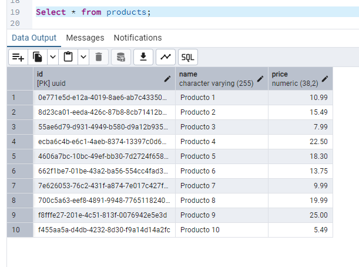
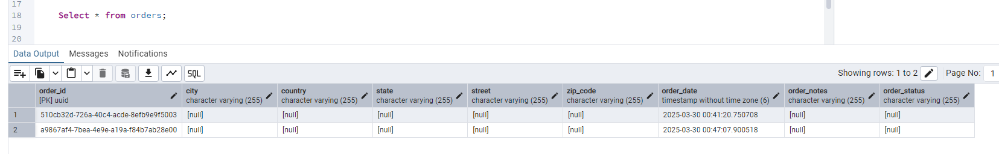
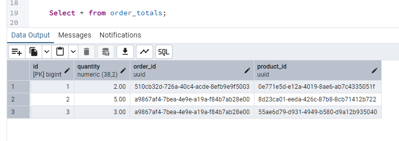

# Sistema de Gestión de Pedidos de Restaurante

Una cadena de restaurantes necesita un sistema para gestionar pedidos en línea.
El sistema debe manejar la creación de pedidos, gestionar el inventario de
ingredientes y facilitar la comunicación entre el área de recepción de pedidos y la
cocina.

- ## API con Java Spring Boot y Arquitectura Hexagonal
Este proyecto es una implementación de dos API en la que se ha desarrollado utilizando Java Spring Boot como framework principal, siguiendo los principios de arquitectura hexagonal para fomentar una separación clara entre las capas de dominio, infraestructura y aplicaciones.

- ## Uso de Lombok
El proyecto utiliza Lombok, una biblioteca de Java que ayuda a reducir el código repetitivo y hacer el código más limpio y mantenible. Con Lombok, se automatiza la generación de métodos comunes. Esto mejora la productividad y la legibilidad del código.

- ## Uso de PostgresSQL
El proyecto usa PostgresSQL como base de datos, en el archivo ``` aplication.properties ``` se encuentran los parámetros de configuración de la conexión.
 
# 1. API Gestion de pedidos
Esta desarrollada usando Sprint Booot, Gradle y Lombok, usa una arquitecura hexagonal. 
Tiene esta estructura:


## Estructura:

```plaintext

├── order/
│ ├── src/main/java/com/wilson/order/
│ │ ├── application/
│ │ │ ├── ports/
│ │ │ │ └── inputs/
│ │ │ └── service/
│ │ ├── domain/
│ │ │ ├── exception/
│ │ │ ├── model/
│ │ │ ├── repository/
│ │ │ └── valueobjects/
│ │ └── infrastructure/
│ │ │ ├── rest/dto/
│ │ │ └── repository/

```

## Diagrama UML del Dominio:

``` mermaid
classDiagram
    class Order {
        +UUID orderId
        +List~OrderTotal~ products
        +String orderStatus
        +LocalDateTime orderDate
        +String orderNotes
        +AddressShipping deliveryAddress
        +addProduct(Product, BigDecimal)
        +removeProduct(Product)
        +calculateTotalValue() BigDecimal
    }

    class Product {
        +UUID id
        +String name
        +BigDecimal price
    }

    class OrderTotal {
        +Product product
        +BigDecimal quantity
        +calculateValue() BigDecimal
    }

    class AddressShipping {
        +String street
        +String city
        +String state
        +String zipCode
        +String country
    }

    class Client {
        +String clientId
        +String clientName
        +String clientAddress
        +String clientPhone
        +String clientEmail
        +String clientStatus
    }

    class ProductRepository {
        <<interface>>
        +findById(UUID) Optional~Product~
    }

    class OrderRepository {
        <<interface>>
        +save(Order) Order
    }

    Order "1" *-- "*" OrderTotal : 
    OrderTotal "1" *-- "1" Product : 
    Order "1" *-- "1" AddressShipping : 
    Order "1" *-- "1" Client : 
    ProductRepository <|.. Product : 
    OrderRepository  <|..  Order : 
```

## Endpoint
``` POST /api/orders ```

## Headers
``` Content-Type: application/json ```

## Parámetros
- customerName (String): Nombre del cliente que realiza la orden.
- products (Array): Lista de productos en la orden con:
    - productId (UUID): Identificador único del producto.
    - quantity (Number): Cantidad de ese producto.

## Ejemplo Body:
``` json
{
  "customerName": "Juan Pérez",
  "products": [
    {
      "productId": "123e4567-e89b-12d3-a456-426614174000",
      "quantity": 2
    },
    {
      "productId": "987fcdeb-51a2-43d7-9b56-254415f67890",
      "quantity": 1
    }
  ]
}
```

## Ejemplo usando curl:
``` sh
curl -X POST http://localhost:8080/api/orders \
-H "Content-Type: application/json" \
-d '{
  "customerName": "Juan Pérez",
  "products": [
    {
      "productId": "123e4567-e89b-12d3-a456-426614174000",
      "quantity": 2
    },
    {
      "productId": "987fcdeb-51a2-43d7-9b56-254415f67890",
      "quantity": 1
    }
  ]
}'
```

## Notas:

- Se debe tener productos en la base de datos creados antes de crear ordenes.
- La relación entre la orden y los productos se encuentran en la tabla ```Total_Order```.

## Screens

* Uso mediante Postman:
<p align="left">
  
</p>

* Tabla de productos:
<p align="left">
  
</p>


* Tabla de ordenes:
<p align="left">
  
</p>


* Tabla de la relación productos y ordenes:
<p align="left">
  
</p>
